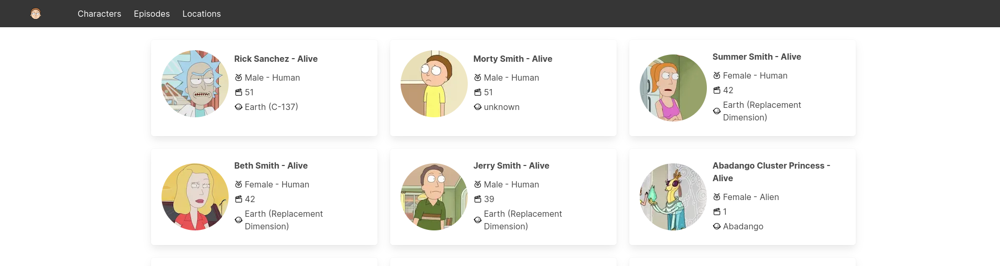

# Rick and Morty Front-end UI

This is a front-end user interface for the Rick and Morty API, developed using Next.js and React, with data fetching and pagination handled using SWR. The UI is styled with the Bulma CSS framework. It allows users to browse and explore character information, locations, and episodes from the popular TV show, Rick and Morty.

## Getting Started

These instructions will help you set up and run the project on your local machine.

### Prerequisites

You need to have Node.js and npm (Node Package Manager) installed on your machine. You can download them from [nodejs.org](https://nodejs.org/).

### Installation

1. Clone the repository to your local machine:

```bash
git clone https://github.com/evokelektrique/rick-and-morty-api-nextjs
```

2. Navigate to the project directory:

```bash
cd rick-and-morty-api-nextjs
```

3. Install the project dependencies using npm and start the development server:

```bash
npm install && npm run dev # if using npm

bun install && bun dev # or if using bun
```

4. Open your browser and access the UI at <http://localhost:3000>.

## Features

**Character Information:** Browse through a list of Rick and Morty characters, with details including name, status, species, gender, origin, and more.

**Location Data:** Explore locations from the show, with information about the name and type of each location.

**Episode List:** View a list of episodes, each with an episode name and air date.

**Pagination:** The UI automatically paginates the results, with options to navigate to the next and previous pages.

### API Documentation

The UI fetches data from the Rick and Morty API. The base URL for the API is <https://rickandmortyapi.com/api>.
Available Resources

Character: Used to retrieve information about characters.<br/>
Location: Used to access location data.<br/>
Episode: Used to retrieve details about episodes.

### Pagination

The API automatically paginates responses, providing up to 20 documents per page. Each resource includes an info object with the following information:

**count:** The total number of items in the response.<br/>
**pages:** The number of pages available.<br/>
**next:** A URL to the next page (if it exists).<br/>
**prev:** A URL to the previous page (if it exists).

You can access different pages by adding the ?page=X parameter to the URL.

## Built With

**Next.js** - A React framework for building server-rendered applications.<br/> 
**React** - A JavaScript library for building user interfaces.<br/>
**SWR** - A React Hooks library for remote data fetching.<br/>
**Bulma** - A modern CSS framework based on Flexbox.

## Author

@evokelektrique

## License

This project is licensed under the MIT License - see the LICENSE file for details.
